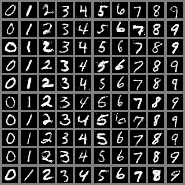

# jittor生成手写数字GAN

## 简介
本赛题提供示例代码，提供数据下载、模型定义、训练步骤等功能。可以基于示例代码填充注释为 TODO 的部分完成该赛题。
特点是：将在数字图片数据集 MNIST 上训练 Conditional GAN（Conditional generative adversarial nets）模型，通过输入一个随机向量 z 和额外的辅助信息 y (如类别标签)，生成特定数字的图像。

## 安装
本项目可再2060显卡上运行，训练时间约为1小时

## 运行环境
-window10

python >= 3.7
jittor >= 1.3.0
pillow >=6.2.1
numpy >=1.18.2

## 推理
可用自己的号码生成图片提交结果查看分数

## 致谢
此项目基于jittor的热身赛，部分代码参考了(https://github.com/Jittor/gan-jittor)